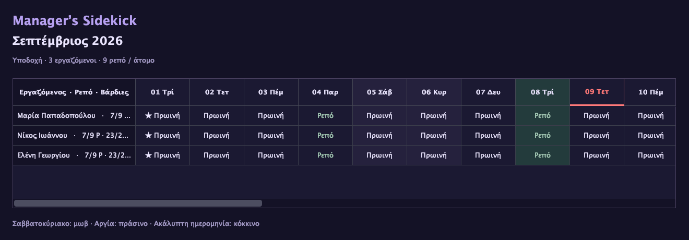
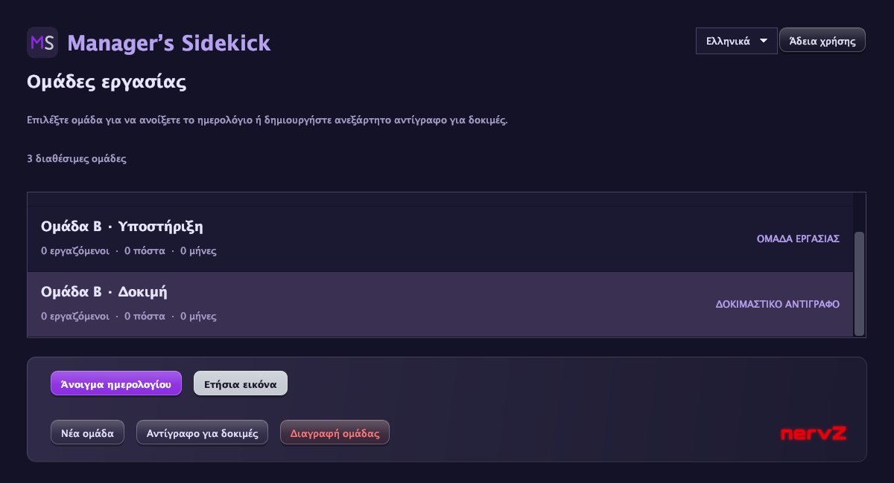
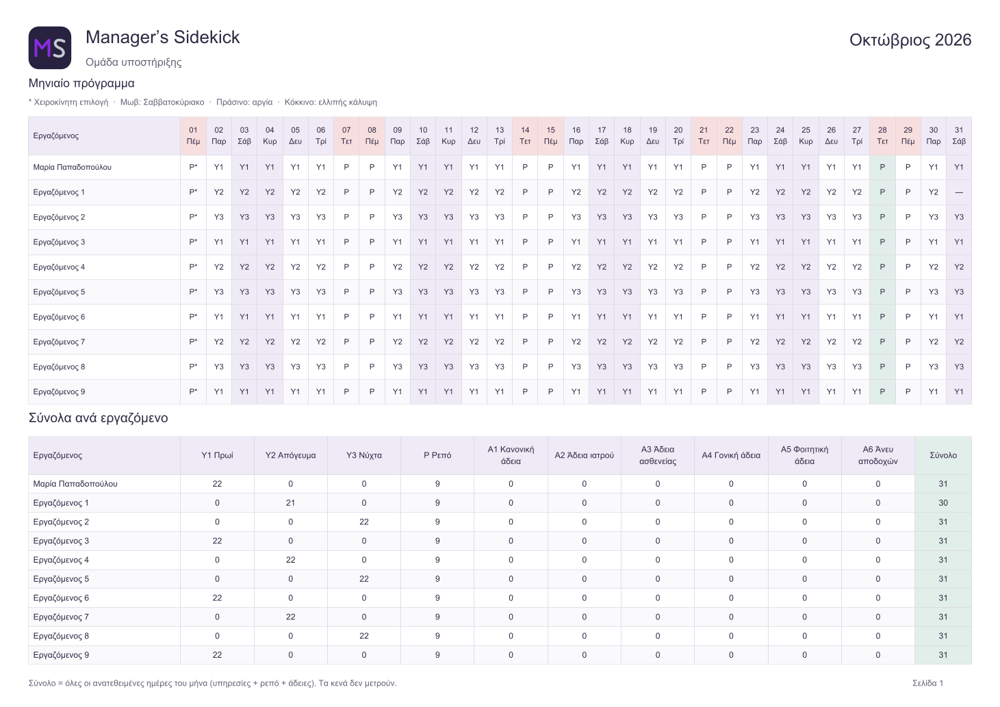

<p align="center">
  
</p>
<h1 align="center">Manager’s Sidekick</h1>
<p align="center"><strong>Shift planning, with you in control.</strong></p>
<p align="center">by </p>
<p align="center"><strong><a href="README.md">English</a> · <a href="README.el.md">Ελληνικά — Ελληνική παρουσίαση</a></strong></p>
<p align="center">Windows · macOS · Linux &nbsp; | &nbsp; Ελληνικά / English &nbsp; | &nbsp; GPL-3.0</p>

Manager’s Sidekick is a free, open-source desktop application for planning a team's monthly shifts. Define duties, employee skills, availability and leave, then calculate the remaining schedule while keeping your manual choices intact.

**[Downloads](https://github.com/jimboL3t/managers-sidekick/releases) · [Getting started](docs/PUBLICATION.en.md) · [Administrator guide](docs/ADMIN_GUIDE.en.md)**

> Version 1.2.2 is being prepared for public release. Downloads are not public yet.


*Calendar preview with sample data. The interface and PDFs support both English and Greek.*

## Plan your team’s month

- **Independent teams:** manage employees, duties and leave types separately; create a copy to try changes safely.
- **Scheduling rules:** account for skills, operating weekdays, staffing demand, availability, rest intervals and consecutive workdays.
- **Your choices stay in place:** assign leave or a requested duty, lock whole days and explore other combinations for the remaining cells.
- **Fairer distribution:** configure night/weekend balancing, reference previous months and control employee participation. [How it works](docs/FAIRNESS.en.md).
- **A longer view:** review annual totals and saved history; export monthly schedules and employee totals to landscape A4 PDF.
- **Local and bilingual:** work in English or Greek without an account or server. Your data stays in local files.

Calculation runs when you request it. Coverage gaps and rule deviations remain visible for review. The scheduler uses a bounded heuristic, so it cannot guarantee a feasible or optimal schedule; review the result before using it. Use one app instance per data folder.

## From teams to a printable schedule

<details>
<summary><strong>Team selection and independent test copies</strong></summary>



</details>

<details>
<summary><strong>PDF schedule and employee totals</strong></summary>



</details>

*Images are rendered from real application components and PDF output using synthetic test data; they are illustrative, not validated work schedules.*

## Get started

1. Once published, choose the **1.2.2 package** for Windows x64, Linux x64, macOS Apple Silicon or macOS Intel from [Releases](https://github.com/jimboL3t/managers-sidekick/releases).
2. Extract the entire archive into a writable folder. The platform packages include Java; no separate Java installation is needed.
3. Follow the included `START-HERE`: Windows uses `start-windows.cmd`; Linux uses `sh start-linux.sh`; macOS uses `sh start-macos.command`.

These are portable archives, not native installers. Linux needs a graphical desktop and the libraries/fonts described in the [platform instructions](docs/PUBLICATION.en.md). Platform testing status is documented there.

**Back up before upgrading.** Portable packages store schedules in `data/sidekick.json` beside the JAR. Keep a separate copy of the data folder before replacing or deleting the application folder. [Backup and restore](docs/BACKUP.en.md).

## Documentation

| I want to… | Read |
|---|---|
| Set up teams and calculate shifts | [Administrator guide](docs/ADMIN_GUIDE.en.md) |
| Balance nights and weekends | [Fair distribution](docs/FAIRNESS.en.md) |
| Install or troubleshoot | [Platform packages](docs/PUBLICATION.en.md) · [Installation](docs/DISTRIBUTION.en.md) |
| Back up or move my schedules | [Backup guide](docs/BACKUP.en.md) |
| Understand the implementation | [Architecture](docs/ARCHITECTURE.en.md) · [Validation](docs/VALIDATION.en.md) |
| See what changed | [Changelog](docs/CHANGELOG.en.md) |

## Build from source

Requires **JDK 21+** and **Maven 3.9+**. From the repository root:

```sh
mvn clean verify
java -jar target/managers-sidekick-1.2.2.jar
```

Runtime libraries: Gson and Apache PDFBox; Swing is included in Java. Maven resolves dependencies automatically. Packaging instructions and pinned dependency/runtime sources are described in the [publication guide](docs/PUBLICATION.en.md).

## License and sources

Copyright © 2026 Dimitrios Diamantis. Application licensed under **GPL-3.0-only**. [License](LICENSE) · [Copyright](COPYING.md) · [Distribution details](docs/LICENSING.en.md).

Each distributed version includes a separate **`all-sources.zip`** with matching application, library and Java sources. GitHub's automatic source ZIP contains only this repository. Third-party licenses and notices remain included in the platform packages.
